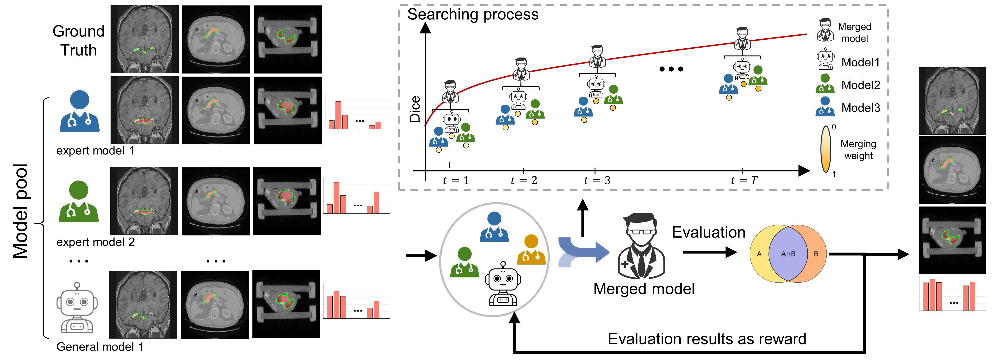
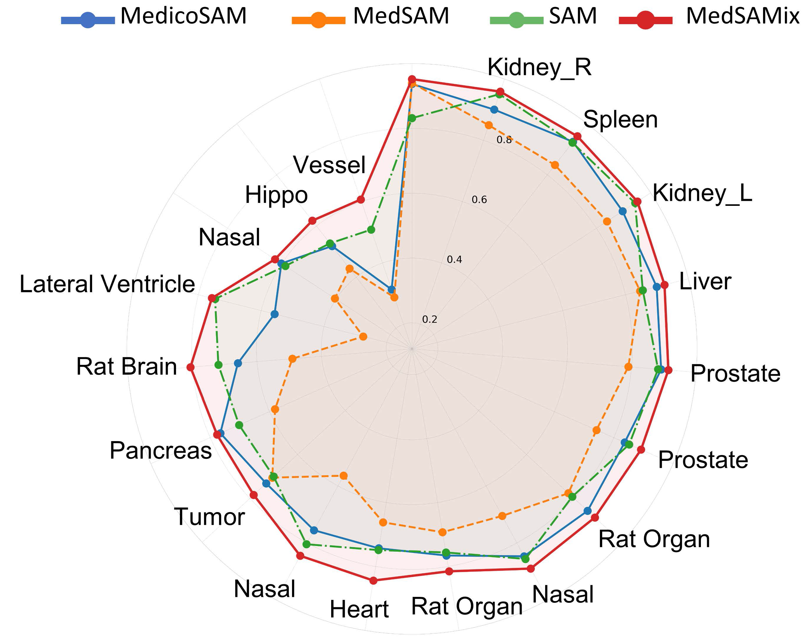

[MedSAMix: A Training-Free Model Merging Approach for Medical Image Segmentation]()

We find that while MedSAM and other fine-tuned SAM-based models perform well on most tasks within their respective domains, they can struggle to generalize to partial or unseen tasks, sometimes even underperforming the original SAM. 

To address this limitation, we propose MedSAMix, a model-merging approach designed to enhance generalization across diverse tasks.

## Code
The code is cleaning and will be public soon!

## Checkpoint
In addition, here we provide raw checkpoint and hugging face tensors:

Pytorch raw checkpoint: [Here](https://drive.google.com/file/d/1RBsDZvFqJiAbbhnXTpSZs_uC-WKWrAJx/view?usp=sharing)

Hugging face: [Here](https://huggingface.co/guinansu/MedSAMix)
